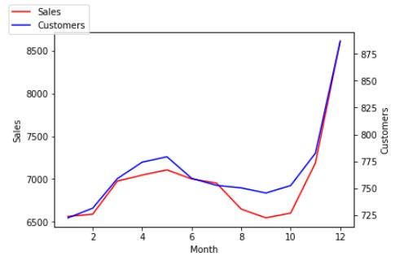
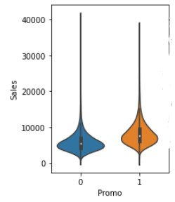
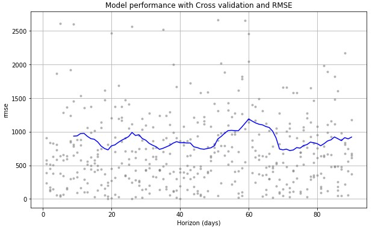
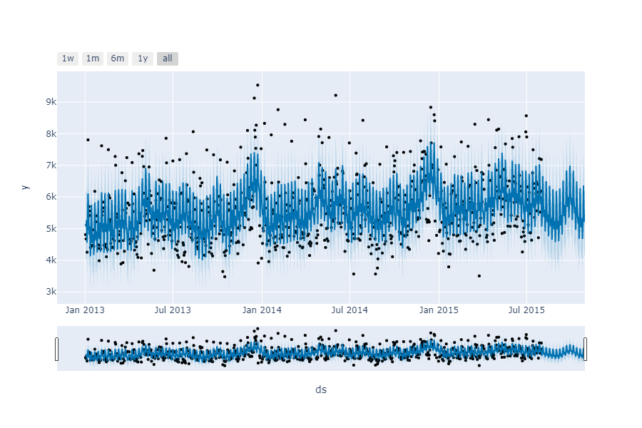
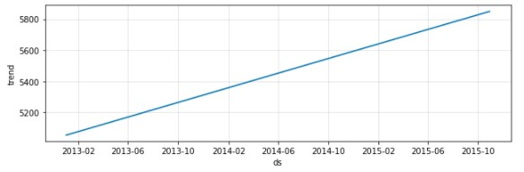
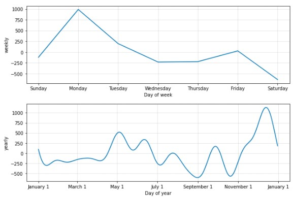
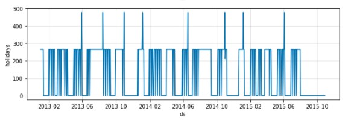
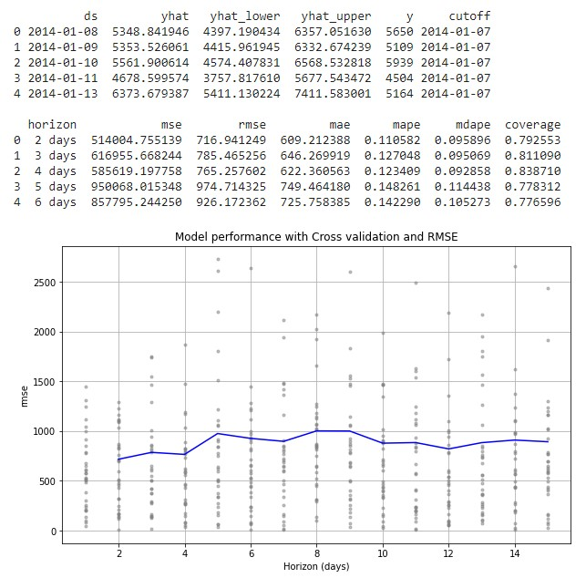

# Sales-forecasting-with-Prophet-and-Time-series
Use Facebook Prophet model to forecast Sales including seasonality patterns

In this notebook, Prophet model is used to forecast Sales at store level with high seasonality effects.

# Dataset
The dataset used collects daily historical sales data from 1,115 Rossmann stores over 31 months resulting into 1+ million transaction records. In addition to transactions, the dataset includes information about promotions, competition and holiday periods at store level. This info is used to incorporate holidays during forecasting step.
The dataset is available on kaggle [here](https://www.kaggle.com/c/rossmann-store-sales/data).

# Facebook Prophet
At its core, the Prophet procedure is an additive regression model with four main components:
  - A piecewise linear or logistic growth curve trend. Prophet automatically detects changes in trends by selecting changepoints from the data.
  - A yearly seasonal component modeled using Fourier series.
  - A weekly seasonal component using dummy variables.
  - A user-provided list of important holidays.

Key points:
- Prophet will provide a components plot which graphically describes the model it has fit.
- The input to Prophet is always a dataframe with two columns: ds and y. The ds (datestamp) column should be of a format expected by Pandas, ideally YYYY-MM-DD for a date or YYYY-MM-DD HH:MM:SS for a timestamp. The y column must be numeric, and represents the measurement we wish to forecast.
- A quick introduction is available [here](https://research.fb.com/blog/2017/02/prophet-forecasting-at-scale/).

# Project structure
1) Exploration and cleaning of the data.
  - Sales reveal a high seasonality at multiple timescale: during the year, within a month and also during a typical week. The seasonality is illustrated below.

  - The analysis also indicates a positive impact from promotions on sales and customer frequentation.
  
  

2) Forecasting using Prophet
  - without information on holidays
  - including detailed information on holiday periods
  
3) Performance evaluation
- Prophet performs very well when seasonality is high. The model's perfromance is evaluated using RMSE metric. It shows that the error remains constant over the projected horizon.
- 90 days horizon:

 

# Results

Forecast over 90 days example:

The additive model analyzes variations at multiple levels:
- long-term base trend
- seasonal 'noise' (yearly, monthly, weekly and daily)
- impact from holidays. In the last picture below, we see some holiday pattern and spikes which may impact sales. These are integrated into the forecasting model.

Performance evaluation with 15 days horizon:

# Dependencies
- Facebook Prophet (pip install fbprophet)

# Next
- benchmark prediction performance against other models :
  - LSTM network
  - XGBoost
  - StatModels
  - Others
